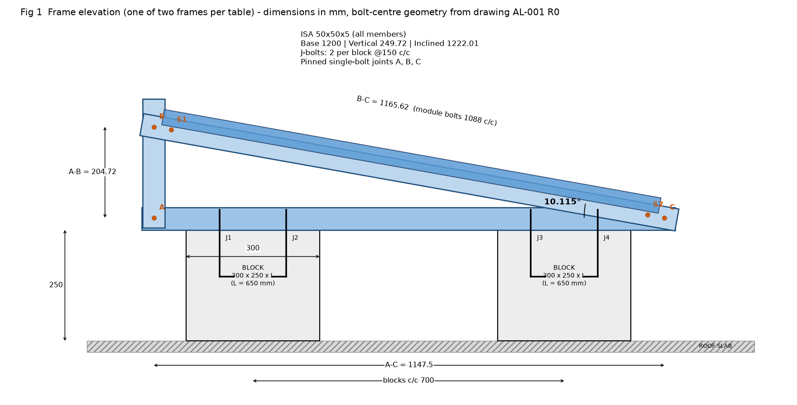
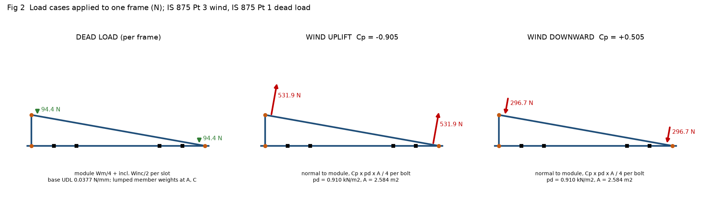
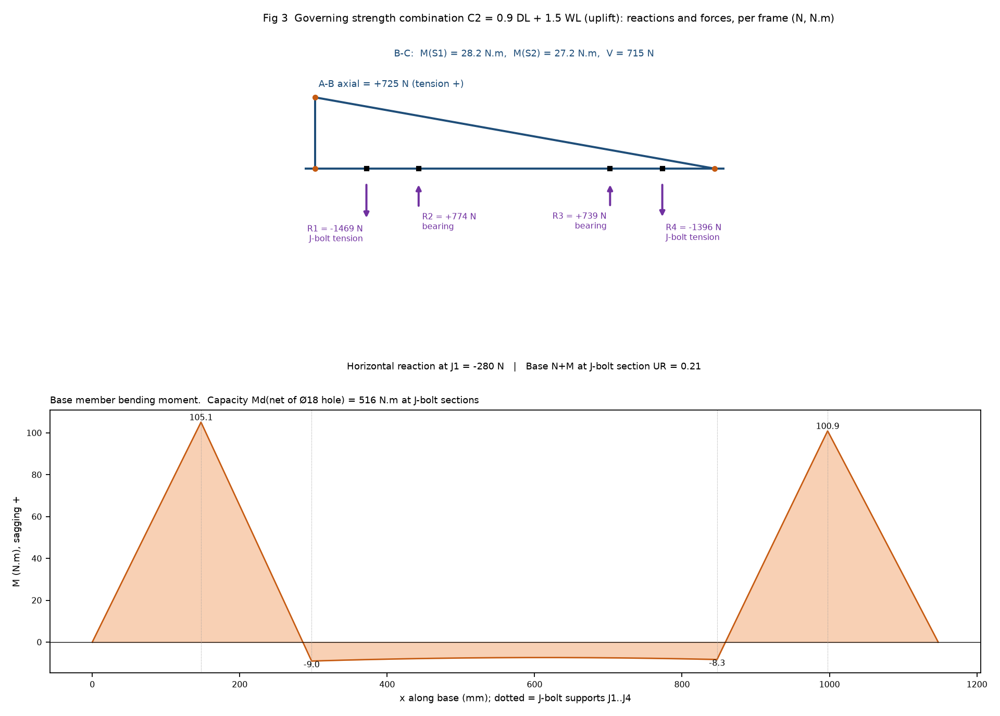
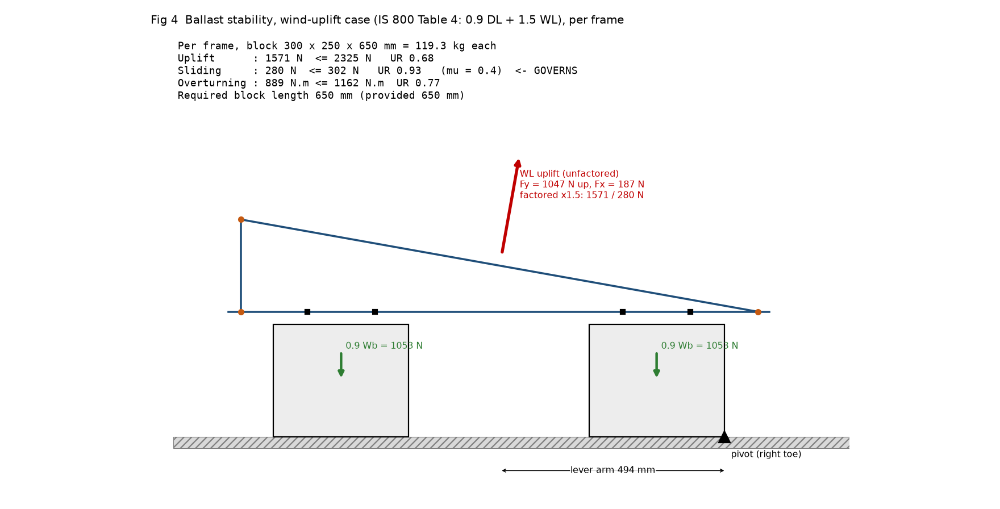

# Design Calculation Report

**45 kWp Ballast-Type Rooftop Module Mounting Structure - CDSCO, Hyderabad**

| Item | Detail |
|---|---|
| Client / EPC | M/s Sai Babuji Projects Pvt Ltd |
| Design & Engg | M/s JSP Solar Energy |
| Drawing | AL-001 R0 (10.09.2026, For Information); Hardware BOM (82 tables) |
| Document | DC-CDSCO-45kWp-R0  -  DRAFT FOR REVIEW  -  30 Sep 2026 |
| Deliverables | Excel calculation workbook (formula-linked) \| STAAD.Pro input file \| this report |
| Codes | IS 875 (Pt 1, Pt 3) \| IS 800:2007 (LSD) \| IS 456:2000 \| IS 1893 (Pt 1):2016 \| IS 808 \| IS 2062 |

*Status of this draft: every numeric result is reproduced by three independent routes (closed-form statics in Excel, a separate matrix-stiffness solver, and a round-trip of the generated STAAD input). STAAD.Pro itself has not been run (not available in the authoring environment); the file is ready to run and the workbook has a comparison table for the STAAD output. Several design-basis inputs are assumptions (Section 3.3) and two are decisive (Section 11).*

## 1  Summary of results

| Check group | Result | Status |
|---|---|---|
| Members (8 checks) | max UR = 0.21 | **PASS** |
| Frame bolts M10 / M12 / M8 (BOM) | max UR = 0.05 | **PASS** |
| Ballast - uplift / sliding / overturning (300x250x650 blocks) | UR 0.68 / 0.93 / 0.77 | **PASS** |
| Required block length (sliding governs) | 650 mm  (119 kg per block; 1.89 kN/m2 average roof load) | **REVIEW** |
| J-bolt anchorage M16 (BOM) / M10 (alternate) | UR bond 0.07 / 0.15 ; required length 150 / 140 mm | **PASS** |
| Deflection (L/180) | UR 0.04 | **PASS** |
| Drawing: Ø18 J-bolt hole edge distance (IS 800 cl 10.2.4.2) | 22.5 mm provided < 27 mm required | **FAIL** |

- **Ballast governs the design.** Structural members and bolts are lightly stressed (UR <= 0.21); the ballast blocks are sized by SLIDING under wind uplift (friction mu = 0.4). The drawing does not give the block length; 650 mm is required for 300 x 250 blocks.
- **M10 J-bolts are adequate.** M10 satisfies every IS 800 / IS 456 check (steel UR 0.04, bond + hook UR 0.15) and, unlike the drawn Ø18 holes, M10 in a Ø12 hole meets the edge-distance rule (Section 12).
- **Decisive assumptions:** design life factor k1 (0.91 vs 1.0), terrain category, roof friction, and the seismic component factor Rp (Section 11). All are single input cells in the workbook.

## 2  Structure and geometry

One table carries one module (45 kWp / 82 tables = 549 Wp, inferred) on two identical planar frames at 1400 mm (module hole pitch). Each frame is three ISA 50x50x5 angles joined by single bolts (base 1200 mm, vertical 249.72 mm, inclined 1222.01 mm) and rests on two 300 x 250 concrete blocks at 700 mm c/c, each tied by two J-bolts at 150 mm c/c (BOM: 8 J-bolts per table = 4 blocks).

| Quantity | Value | Basis |
|---|---|---|
| A-C / A-B / B-C (bolt centres) | 1147.50 / 204.72 / 1165.62 mm | Drawing sheet 2, derived |
| Triangle closure | -0.0015 mm | hypot(AC,AB) - BC; verified |
| Tilt | 10.115 deg | atan(AB/AC); 250/1200 shortcut (11.77 deg) rejected |
| J-bolt positions from A | 147.5, 297.5, 847.5, 997.5 mm | 175/325/875/1025 from base end |
| Module bolt points from B | 39.53 and 1127.54 mm (c/c 1088.01) | slots 67 mm from member ends; drawn 1088 c/c |

## 3  Design basis

### 3.1  Codes and materials

| Item | Adopted | Status |
|---|---|---|
| Steel members | ISA 50x50x5 (IS 808), IS 2062 E250: fy 250, fu 410, E 2x10^5 MPa | Assumed grade |
| Bolts | HDG class 8.8 (fub 800, fyb 640); module bolts SS-304 taken as A2-70 (700/450) | SS class assumed |
| Partial factors | gamma_m0 1.10, gamma_m1 1.25, gamma_mb 1.25 (IS 800 Table 5) | Recalled |
| Load combinations | IS 800 Table 4: 1.5(DL+WL); 0.9 DL + 1.5 WL (stabilising); EQ likewise | Verified |
| Concrete blocks | M20, plain, 24 kN/m3 (IS 875-1); tau_bd 1.2 N/mm2 (IS 456 cl 26.2.1.1) | Verified / assumed grade |
| Section (computed) | A 480.3 mm2, Ixx=Iyy 10.96 cm4, Ixy -6.42 cm4, Iuu 17.38, Ivv 4.55 cm4 (exact polygon, r1 7 / r2 3.5); IS 808 catalogue agrees <1 % | Verified by two methods |

### 3.2  Unsymmetric bending of angles

Loads act in the plane of the legs, so the angle bends obliquely. Stress is evaluated with the unsymmetric-bending relation sigma/M = (Iyy y - Ixy x)/(Ixx Iyy - Ixy^2) at every vertex: Z_eff = 2350 mm3 (gross) and 2272 mm3 (net of the Ø18 J-bolt hole). In-plane stiffness uses I_eff = 72083 mm4 (section free to deflect sideways), which also feeds STAAD.

### 3.3  Assumptions (each is one input cell)

- 1 table = 1 module (45 kWp / 82 = 549 Wp) carried on 2 frames at 1400 mm (module hole pitch); 4 blocks and 8 J-bolts per table (matches BOM).
- Module 550 Wp, 2279 x 1134 x 35, 29.1 kg. Wind load shared equally by the 4 module bolts.
- Terrain category 2 (conservative; Cat 3 = dense urban lowers pd by ~16 %), roof level 12 m, k1 = 0.91 (25-yr). k1 = 1.0 would raise pd by 21 %.
- Net pressure coefficient (Table 7, solidity 0) applied as a uniform pressure over the module; no roof edge/corner zoning, no shielding by adjacent rows (conservative for interior rows).
- Friction coefficient 0.4 between block and roof; roof finish not known. No roof anchorage assumed.
- Members E250 (fy 250, fu 410). Holes at bolt gauge 27.5 from heel; frame bolt line 27.5 above block top; eccentricities between bolt line and member centroid neglected.
- Single bolt per lap joint = moment-free; angle loaded through one leg (cl 7.5.1.2, single bolt, hinged). No LTB reduction (spans <= 550 mm).
- Seismic: Zone II, I = 1.0, Sa/g = 2.5, Ah per assumed component formula (Rp = 2.5). Seismic sliding is sensitive to Rp - see Register.
- J-bolt: plain-bar bond (tau_bd 1.2, M20) + standard hook 16 phi; practical minimum embedment 100 mm; concrete cone breakout not checked (no IS provision).

## 4  Loads

### 4.1  Wind - IS 875 (Part 3)

| Step | Expression | Value |
|---|---|---|
| Basic wind speed | Vb (Hyderabad, Annex A) | 44 m/s |
| Risk coefficient | k1 (25-yr life, house value) | 0.91 |
| Height / terrain | z = 12.52 m, Category 2 -> k2 (Table 2, interpolated) | 1.0252 |
| Topography, cyclonic | k3, k4 | 1.0, 1.0 |
| Design wind speed | Vz = Vb k1 k2 k3 k4 | 41.05 m/s |
| Wind pressure | pz = 0.6 Vz^2 | 1.0111 kN/m2 |
| Design pressure | pd = Kd Ka Kc pz = 0.9 x 1.0 x 1.0 x pz | 0.9100 kN/m2 |
| Net Cp, Table 7 mono-slope free roof (solidity 0) | interpolated at 10.115 deg | 0.5046 down / -0.9046 uplift |
| Module area | 2279 x 1134 mm | 2.5844 m2 |
| Force normal to module | Cp pd A | 2127 N uplift / 1187 N down |
| Per module bolt (4 per module) | F/4 | 531.9 N uplift / 296.7 N down |

*Limitations: IS 875-3 has no rooftop-PV or roof edge/corner provision; uniform net pressure is applied and shielding by adjacent rows is ignored (conservative for interior rows). Hyderabad Vb = 44 m/s is confirmed by two secondary sources; the code text itself could not be opened (see Appendix A).*

### 4.2  Dead and seismic load

| Item | Value |
|---|---|
| Module | 29.1 kg = 285.5 N (datasheet search, single source) |
| Steel | 0.0377 N/mm = 3.84 kg/m; base 45.2 N, vertical 9.4 N, inclined 46.1 N |
| Ballast block | 300 x 250 x 650 mm x 24 kN/m3 = 1170.0 N (119.3 kg) |
| Seismic | Ah = (Z/2) I (Sa/g)(1+z/h)/Rp = (0.10/2)(1.0)(2.5)(2.0)/2.5 = 0.100  (horizontal only; Zone II) |

### 4.3  Load combinations - IS 800:2007 Table 4

| No. | Combination | Use |
|---|---|---|
| C1 | 1.5DL+1.5WL(dn) | strength |
| C2 | 0.9DL+1.5WL(up) | strength |
| C3 | 1.5DL+1.5EQ(+x) | strength |
| C4 | 1.5DL-1.5EQ(+x) | strength |
| C5 | 0.9DL+1.5EQ(+x) | strength |
| C6 | 0.9DL-1.5EQ(+x) | strength |
| S1 | DL+WL(dn) | serviceability (unfactored) |
| S2 | DL+WL(up) | serviceability (unfactored) |

## 5  Analysis

The frame is analysed as a plane model (STAAD file staad/CDSCO_45kW_Ballast_Frame.std): single-bolt joints are moment-free (vertical member is a truss element; inclined member pinned at C); the base member is continuous over four rigid J-bolt supports (J1 restrained in X and Y, J2-J4 in Y). Load points are the module bolts. The inclined member and vertical member are statically determinate; the base beam is solved with the three-moment equation in the workbook and with a full stiffness solution in STAAD.

| Result (per frame) | C1 1.5DL+1.5WL(dn) | C2 0.9DL+1.5WL(up) |
|---|---|---|
| J1 reaction FY (N) | 1263.4 | -1468.5 |
| J2 reaction FY (N) | -623.9 | 774.2 |
| J3 reaction FY (N) | -585.2 | 738.8 |
| J4 reaction FY (N) | 1187.1 | -1396.1 |
| J1 horizontal reaction FX (N) | 156.3 | -280.2 |
| Vertical member axial (tension +, N) | -592.9 | 724.5 |
| Inclined moment at S1 / S2 (N.m) | -23.1 / -22.3 | 28.2 / 27.2 |
| Base moment at J1 / J2 / J3 / J4 (N.m) | -90.4 / 5.9 / 5.1 / -85.8 | 105.1 / -9.0 / -8.3 / 100.9 |

Note the J-bolt reactions: continuity of the base angle over each bolt pair turns the overhang load into a couple, so J1 carries about four times the average uplift share (Fig 3).

### 5.1  Cross-checks performed

- Closed-form statics (Excel) vs independent matrix-stiffness solver: agree to 1.7e-11 for all four load cases (reactions, moments, axial forces, tip deflections); equilibrium identities hold to machine precision.
- Excel recalculated in LibreOffice: 218 key cells compared with the Python engine, worst difference 1.2e-14; no formula errors in 1271 formulas.
- STAAD input text re-parsed and solved: agrees with the workbook to 5.5e-8 for all 8 combinations (print-precision level).
- Not done: an actual STAAD.Pro run. Expected reactions are in staad/expected_results.csv and the workbook sheet STAAD_Map compares them automatically.

## 6  Member design - IS 800:2007

| Check | Demand (envelope C1-C6) | Capacity | UR |
|---|---|---|---|
| Vertical - tension (cl 6.2, 6.3) | 725 N | Td = 87230 N | 0.008 |
| Vertical - compression (cl 7.1.2, 7.5.1.2, Table 12) | 593 N | Pd = 37026 N (lambda_e 1.43) | 0.016 |
| Inclined - N + M tension (cl 9.3.1) | N 104 N, M 28.2 N.m | Td, Md = 534 N.m | 0.054 |
| Inclined - N + M compression (cl 9.3.2) | N 157 N, M 28.2 N.m | Pd = 27906 N | 0.058 |
| Inclined - shear (cl 8.4) | 715 N | Vd = 32804 N | 0.022 |
| Base - N + M at J-bolt sections (net of Ø18 hole) | M 105.1 N.m | Md(net) = 516 N.m | 0.208 |
| Base - N + M at mid-span | M 48.1 N.m | Md = 534 N.m | 0.095 |
| Base - shear (cl 8.4) | 763 N | Vd = 32804 N | 0.023 |

*Bending is elastic with the unsymmetric-bending modulus; no lateral-torsional reduction is applied (unsupported lengths <= 550 mm). Tearing of the net section (cl 6.3.3) uses beta = 0.7, the lower bound, for single-bolt connections. Axial-bending interaction is the conservative linear sum.*

## 7  Connections - IS 800:2007 cl 10.3 and 10.2

| Bolt / joint | V (N) | T (N) | Vdsb / Vdpb (N) | Tdb (N) | UR |
|---|---|---|---|---|---|
| M10 A base-vertical | 725 | 0 | 21431 / 15375 | 33408 | 0.047 |
| M10 B vertical-inclined | 725 | 0 | 21431 / 15375 | 33408 | 0.047 |
| M12 C base-inclined | 732 | 0 | 31149 / 18450 | 48557 | 0.040 |
| M8 module (SS A2-70) | 39 | 714 | 11833 / 19133 | 18446 | 0.039 |

Single bolt, single shear, threads in the shear plane. Bearing on 5 mm angle legs with kb = e/(3 d0) = 0.536 and the 0.7 reduction for holes larger than standard (cl 10.3.4) - applied to M10/M12 in Ø14 holes and M8 in the 9x14 slot. Bolt utilisation is very low (<= 0.05); the limiting feature is the hole detailing below.

| Hole | d0 (mm) | Edge/end provided (mm) | 1.5 d0 (mm) | Status |
|---|---|---|---|---|
| Base Ø14 @A (end 27.5) | 14 | 22.5 | 21.0 | **PASS** |
| Base Ø14 @C (end 25) | 14 | 22.5 | 21.0 | **PASS** |
| Base Ø18 J-bolt (edge) | 18 | 22.5 | 27.0 | **FAIL** |
| Vertical Ø14 (end 22.5) | 14 | 22.5 | 21.0 | **PASS** |
| Inclined Ø14 @B (end 27.47) | 14 | 22.5 | 21.0 | **PASS** |
| Inclined Ø14 @C (end 28.92) | 14 | 22.5 | 21.0 | **PASS** |
| Inclined slot 9x14 (edge) | 9 | 22.5 | 13.5 | **PASS** |

## 8  Ballast stability: uplift, sliding, overturning

Per frame. Resisting dead load is factored by 0.9 and wind by 1.5 (IS 800 Table 4). Friction mu = 0.4 (SEAOC PV2 conservative value; roof finish unknown). No roof anchorage is assumed; the J-bolts tie the frame to the block, and the block mass resists uplift.

| Criterion | Required block weight | Expression |
|---|---|---|
| Uplift | 751 N (77 kg) | 0.9 (Wfs + 2Wb) >= 1.5 Fuy |
| Sliding (horizontal movement) | 1140 N (116 kg)  <- governs | mu [0.9 W - 1.5 Fuy] >= 1.5 Fux |
| Overturning (right toe) | 867 N (88 kg) | 0.9 M_restoring >= 1.5 M_overturning |
| Per-block uplift (J-bolt reactions) | 772 N (79 kg) | 0.9 Wb >= T_block (frame continuity) |
| Required block length, 300 x 250 section | 633 mm -> 650 mm | Wb / (gamma_c w h) |

| Check (provided 300x250x650 blocks) | Demand (N or N.mm) | Capacity | UR | Status |
|---|---|---|---|---|
| Uplift | 1571 | 2325 | 0.676 | **PASS** |
| Sliding - wind uplift | 280 | 302 | 0.929 | **PASS** |
| Overturning - wind uplift | 888726 | 1161631 | 0.765 | **PASS** |
| Per-block uplift | 694 | 1053 | 0.659 | **PASS** |
| Sliding - downward wind | 156 | 1901 | 0.082 | **PASS** |
| Overturning - downward wind | 0 | 1939151 | 0.000 | **PASS** |
| Sliding - seismic | 388 | 930 | 0.417 | **PASS** |
| Overturning - seismic | 58272 | 1161631 | 0.050 | **PASS** |

Roof load: 4 blocks x 119 kg + array = 1.89 kN/m2 average over the table footprint. The building structural engineer must confirm the slab/beam capacity (not part of this scope). Seismic sliding utilisation (0.42) does not depend on block weight; it rises above 1.0 if the component factor Rp is taken as 1.0 (Section 11).

## 9  J-bolt anchorage - M16 (as drawn) and M10 (alternate)

| Item | M16 | M10 | Basis |
|---|---|---|---|
| Max factored tension per bolt (N) | 1469 | 1469 | continuous-beam reactions J1..J4 |
| Shear per bolt (N) | 70 | 70 | max H / 4 |
| Tdb, cl 10.3.5 (N) | 90432 | 33408 | 0.9 fub An / gamma_mb |
| UR - tension | 0.016 | 0.044 |  |
| UR - shear + tension, cl 10.3.6 | 0.0003 | 0.0020 | (V/Vd)^2 + (T/Tdb)^2 |
| Hook anchorage value 16 phi (mm) | 256 | 160 | IS 456 cl 26.2.2.1 |
| tau_bd, M20 plain bar (MPa) | 1.2 | 1.2 | IS 456 cl 26.2.1.1 |
| Bond + hook capacity, 100 mm straight embedment (N) | 21473 | 9802 | tau pi phi (Ls + 16 phi) |
| UR - bond + hook | 0.068 | 0.150 |  |
| Projection above block (mm) | 44.8 | 33.9 | leg 5 + plate 5 + 4 washers + spring + nut + thread |
| REQUIRED J-BOLT SHANK LENGTH (mm) | 150 | 140 | BOM M16 = 150 mm: adequate |

*Bond governs: the required straight embedment computes to zero because the standard hook alone (16 phi) covers the demand; a practical 100 mm minimum embedment is adopted (engineering practice, not IS). Concrete-cone breakout and side-blowout of the J-bolts in a 300 x 250 block are not covered by any IS and are NOT checked; the block mass (Section 8) provides the uplift resistance. The Ø18 hole in the 50 mm leg cannot satisfy cl 10.2.4.2 (Section 12).*

## 10  Deflection - IS 800 cl 5.6.1, Table 6

| Member | Service combination | Deflection (mm) | Limit (mm) | UR |
|---|---|---|---|---|
| Inclined B-C, mid-span (L/180) | DL + WL (up) | 0.200 | 6.48 | 0.031 |
| Base overhang at A (2a/180) | DL + WL (up) | 0.063 | 1.64 | 0.039 |
| Base overhang at C (2c/180) | DL + WL (up) | 0.063 | 1.67 | 0.038 |

## 11  Sensitivity to the decisive assumptions

| Scenario | pd (kN/m2) | Required block length (mm) | Governs | Max UR at 650 mm | Seismic sliding UR |
|---|---|---|---|---|---|
| Base case (as issued) | 0.910 | 650 (633) | Sliding | 0.93 | 0.42 |
| k1 = 1.00 (50-yr life) | 1.099 | 800 (779) | Sliding | 1.98 | 0.42 |
| Terrain Cat 3 (dense urban) | 0.765 | 550 (522) | Sliding | 0.64 | 0.42 |
| Roof level 15 m (taller building) | 0.958 | 700 (671) | Sliding | 1.10 | 0.42 |
| mu = 0.5 (rougher roof finish) | 0.910 | 600 (590) | Sliding | 0.77 | 0.33 |
| mu = 0.3 (smooth / membrane) | 0.910 | 750 (705) | Sliding | 1.24 | 0.56 |
| Module 27.5 kg (lighter) | 0.910 | 650 (636) | Sliding | 0.94 | 0.42 |
| Seismic Rp = 1.0 (no reduction) | 0.910 | 650 (633) | Sliding | 1.04 | 1.04 |
| Worst: k1=1.0 + roof 15 m + mu=0.3 | 1.157 | 950 (916) | Sliding | 3.63 | 0.56 |

Reading: the required block length moves between 550 mm (Category 3) and 950 mm (combined worst case); sliding governs in every case, so a higher roof friction coefficient (tested value) is the most economical lever. Seismic sliding exceeds 1.0 at Rp = 1.0 for any block size: the IS 1893 component provisions must be confirmed before issue.

## 12  Observations on the drawing and BOM

- **O1:** J-bolt holes Ø18 in a 50 mm leg: smaller edge distance 22.5 mm < 1.5 d0 = 27 mm (IS 800 cl 10.2.4.2). Cannot be cured by moving the hole (max possible minimum edge distance in a 50 mm leg = 25 mm). Options: M12 J-bolt in Ø14 hole (1.5 d0 = 21 mm OK), or M10 J-bolt in Ø12 hole (18 mm OK) - which also supports the M10 alternative checked in this workbook.
- **O2:** M10 bolts (BOM 2, 3) in Ø14 holes = 4 mm clearance (standard 1-2 mm). Bearing reduced x0.7 (cl 10.3.4). Recommend Ø11/Ø12 holes.
- **O3:** Ballast block LENGTH (across the frame) is not on the drawing. Design result: governing criterion is SLIDING; required length is on the Summary sheet for 300 w x 250 h blocks (mu = 0.4). Drawing should state it.
- **O4:** Base member is continuous over the two J-bolts of each block; overhang loads create a couple on the bolt pair (J1 uplift is ~4x the average share). The J-bolt design uses the continuous-beam reactions, not the average.
- **O5:** BOM 'Total Qty' column shows ####### (narrow column). Totals = 82 x qty/table: 164, 164, 164, 328, 656.
- **O6:** Drawing note says 'dimensions in meters' but all values are mm.
- **O7:** Out-of-plane (east-west) stability of each frame relies on the module acting as a link between the 2 frames and on the J-bolt pairs; no out-of-plane load is in the model. Wind direction parallel to the ridge gives small horizontal load; recommended to confirm with client's module clamp details.

## 13  Verification, limitations and open items

- Sources: Vb, Kd/Ka, IS 800 Table 4/Table 12/cl 10.3.4 and IS 456 bond/hook values were corroborated by web search; Table 7 Cp comes from the validated house table; other values are recalled (Appendix A). The primary code texts (law.resource.org, iitk.ac.in, Bentley docs) were blocked by the environment and were NOT opened: verify every clause number against licensed copies before issue.
- A web-search snippet for ISA 50x50x5 (Cxx 1.24 cm, Iuu 10.2 cm4) was rejected: Iuu + Ivv must equal Ixx + Iyy; the section was computed from geometry and agrees with the IS 808 catalogue.
- STAAD.Pro was not run. To complete: open staad/CDSCO_45kW_Ballast_Frame.std, Analyze, paste reactions into Excel sheet STAAD_Map (tolerance 1 %), then produce the XtraReport per staad/REPORT_STEPS.md.
- Open inputs to confirm with the client: module model and weight, design life (k1), terrain and building height, roof finish / friction, block length, seismic basis, steel grade, SS bolt class.
- Not in scope: roof slab capacity, module clamp capacity, corrosion/HDG thickness, construction loads.

| Prepared | Checked | Approved |
|---|---|---|
|  |  |  |
| Name / date: | Name / date: | Name / date: |

---

## Appendix A  Verification register

| # | Value / provision | Source | Status | Comment |
|---|---|---|---|---|
| 1 | Basic wind speed Vb, Hyderabad = 44 m/s | IS 875-3 Annex A | Verified (2 search sources: IITK-GSDMA W02, infralens) | Primary code text not opened (egress blocked) |
| 2 | Kd = 0.9 (frames), Ka = 1.0 (<=10 m2), Kc combination | IS 875-3:2015 cl 7.2.1, 7.2.2, 7.3.3.13 | Verified (search) | Kc=0.9 applies to combined wall+roof+internal pressures; net Cp used here so Kc=1.0 (house practice) |
| 3 | k1 = 0.91 (25-yr life) | IS 875-3 Table 1 (house value, issued ground-mount jobs) | Assumption | k1 = 1.0 (50-yr, occupied building) raises pd by 21 % -> see Notes sensitivity |
| 4 | k2 Cat 2: 1.00 @10 m, 1.05 @15 m, 1.07 @20 m; Cat 3: 0.91, 0.97, 1.01 | IS 875-3 Table 2 | 10 m/Cat 2 verified (house); remaining values RECALLED | The search result only echoed the query -> not independent confirmation |
| 5 | Cp (mono-slope free roof, phi=0): 10 deg +0.5/-0.9; 15 deg +0.7/-1.1 | IS 875-3 Table 7 | Verified (house: checked against table image in an issued design document) | Linear interpolation at 10.115 deg |
| 6 | Load combinations 1.5(DL+WL); 0.9DL + 1.5WL | IS 800:2007 Table 4 | Verified (search) |  |
| 7 | gamma_m0 = 1.10, gamma_m1 = 1.25, gamma_mb = 1.25 | IS 800:2007 Table 5 | Recalled | Standard values |
| 8 | Table 12: single bolt, hinged: k1=1.25, k2=0.50, k3=60 | IS 800:2007 cl 7.5.1.2 | Verified (search) |  |
| 9 | Bearing reduction 0.7 for oversize / short-slot holes | IS 800:2007 cl 10.3.4 | Verified (search) | Applied conservatively to M10/M12 in Ø14 holes and M8 in 9x14 slot |
| 10 | Min edge/end distance 1.5 d0 (rolled / machine-flame-cut) | IS 800:2007 cl 10.2.4.2 | Recalled | Ø18 J-bolt hole FAILS (22.5 < 27) |
| 11 | tau_bd (M20, plain bar, tension) = 1.2 N/mm2; hook = 16 phi | IS 456:2000 cl 26.2.1.1, 26.2.2.1 | Verified (multiple search sources) |  |
| 12 | Zone II, Z = 0.10 (Hyderabad); Sa/g = 2.5 | IS 1893 (Part 1):2016 Table 3, cl 6.4.2 | Recalled | Zone/Z to be confirmed by client basis |
| 13 | Component seismic coefficient Ah = (Z/2) I (Sa/g)(1+z/h)/Rp, Rp = 2.5 | IS 1893-1:2016 (component provisions; ASCE-type form) | ASSUMPTION - clause text not retrievable offline | Rp = 1 gives Ah = 0.25: seismic sliding UR rises to 1.04 (FAIL) -> confirm Rp |
| 14 | Friction coefficient mu = 0.4 | SEAOC PV2 (search: conservative value unless test-justified) | Verified source / assumed surface | Roof finish unknown |
| 15 | Module 550 Wp, 2279 x 1134 x 35 mm, 29.1 kg; holes 1400 x ~1090 mm | Manufacturer datasheets (search) | Single-source weight; hole pitch consistent with drawing (slots 1088 c/c) | Replace with actual module |
| 16 | ISA 50x50x5: A=480.3 mm2, Ixx=Iyy=10.96 cm4, Iuu=17.38, Ivv=4.55 | Computed (exact polygon, r1=7, r2=3.5); IS 808 catalogue A=4.80, I=11.0, Iuu=17.5, Ivv=4.5 | Verified by two methods | REJECTED search snippet (Cxx 1.24 cm, Iuu 10.2, Ivv 2.66): Iuu+Ivv must equal Ixx+Iyy = 21.9 cm4 |
| 17 | Concrete 24 kN/m3, steel 78.5 kN/m3 | IS 875-1 Table 1 | Recalled |  |
| 18 | Bolt stress areas M8 36.6, M10 58, M12 84.3, M16 157 mm2; 8.8: fub 800, fyb 640 | ISO 898-1 / IS 1367 | Recalled | SS A2-70 (700/450) is an ASSUMPTION - BOM gives no class |
| 19 | Primary sources NOT opened | law.resource.org, iitk.ac.in, docs.bentley.com, easy-calc.com, eng-tips.com | Blocked by environment egress policy | Cross-check every clause number against licensed code copies before issue |

